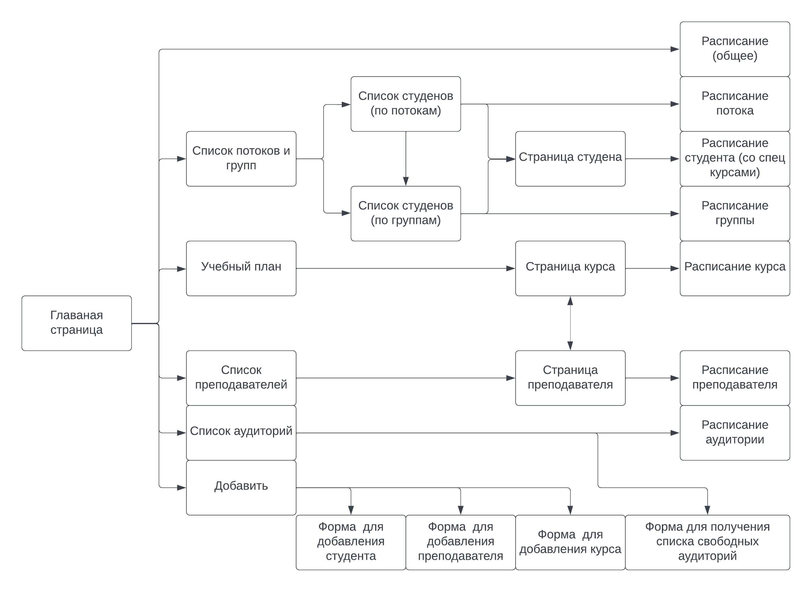
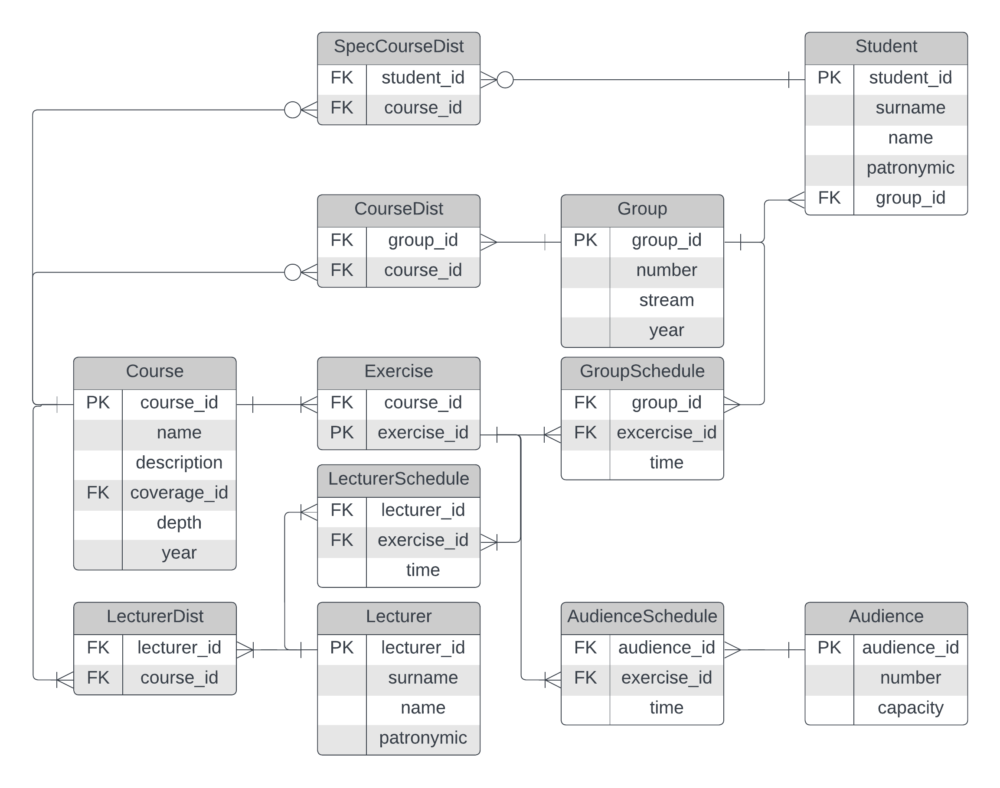

# Учебное расписание

## Сценарии использования

### Получение списков студентов по потокам и группам

 * Перейти на главную страницу

 * Перейти на страницу "Список потоков и групп"

 * Выбрать нужный поток или группу

### Получение списков преподавателей, в т.ч. по проводимым курсам

 * Перейти на главную страницу

 * Перейти на страницу "Читаемые курсы"
 
 * Перейти на страницу нужного курса, выбрав его из списка

 * На странице курса найти информацию о преподавателях

### Получение списков аудиторий, свободных в определенном интервале

 * Перейти на главную страницу

 * Перейти на страницу "Список аудиторий"

 * Перейти на страницу "Форма для получения списка свободных аудиторий"

 * Заполнить необходимые поля формы

### Добавление студентов, преподавателей или курса

 * Перейти на главную страницу

 * Перейти на страницу "Форма  для добавления студента, преподавателя или курса"

 * Заполнить необходимые поля формы

### Удаление студентов, чтение и редактирование данных о них, занесение студента в список слушателей спец. курса

 * Пользуясь пунктом [Получение списков студентов по потокам и группам](https://github.com/hkctkuy/Web-technology-labs#Получение-списков-студентов-по-потокам-и-группам) найти нужного студента и перейти на его страницу

 * Далее нажать кнопки в соответствии с желаемым действием

### Удаление преподавателей, чтение и редактирование данных о них, занесение студента в список слушателей спец. курса

 * Перейти на главную страницу

 * Перейти на страницу "Список преподавателей"

 * Найти нужного преподавателя и перейти на его страницу

 * Далее нажать кнопки в соответствии с желаемым действием

### Удаление курса, чтение и редактирование данных о нем

 * Перейти на главную страницу

 * Перейти на страницу "Читаемые курсы"

 * Найти нужный курс и перейти на его страницу

 * Далее нажать кнопки в соответствии с желаемым действием

### Получение расписания на заданный интервал времени для студента, преподавателя или аудитории

 * В соответствии с указанными выше пунктами найти в списках нужного студента, преподавателя или аудиторию

 * В случае студента или преподавателя далее перейти на страницу "Расписание студента" или "Расписание преподавателя" соответственно

### Составление расписания занятий для курса на семестр

 * В соответствии с указанными выше пунктами найти в списках нужного курса

 * Нажать кнопку "Составить расписание курса"

## Описание страниц

 * С любой страницы можно перейти на главную
 
 * Почти все имена и названия курсов являются гипертекстом на соответствующие
   станицы

### Главная страница

 * Ссылка на общее расписание

 * Ссылка на список потоков и групп 

 * Ссылка на учебный план

 * Ссылка на список читаемых курсов

 * Ссылка на список преподавателей

 * Ссылка на список аудиторий

 * Ссылка на страницу для добавления студента, преподавателя или курса

### Страницы-списки

 * Содержат списки с указанным содержимым

 * Список аудиторий также содержит информацию о вместимости аудиторий

### Страницы-расписания

 * Содержат расписания указанного содержимого

 * Представляет из себя таблицы, соответствующие разным курсам

 * Столбцы таблицы - номера групп

 * Строки таблицы - временные промежутки, соответствующие парам, сгруппированные по дням недели

 * Ячейка таблицы соответствует занятию, проходящему в данное время данной группы

 * Ячейка содержит название курса, имя преподавателя, номер аудитории

### Страницы студентов

 * ФИО студента

 * Год обучения, поток, группа

 * Какие курсы и когда посещал

 * Содержит кнопку для редактирования страницы

### Станицы преподавателей

 * ФИО преподавателя

 * Проводимые курсы

 * Содержит кнопку для редактирования страницы

### Страницы курсов

 * Название

 * Охват: поток, группа, спец. курс

 * Интенсивность (сколько пар в неделю)

 * Год обучения (для обязательных)

 * Содержит кнопку для редактирования страницы

### Учебный план

 * Содержит таблицу по семестрам с курсами и их интенсивностью

 * Содержит список спец. курсов

### Добавить

 * Ссылка на форму для добавления студента

 * Ссылка на форму для добавления преподавателя

 * Ссылка на форму для добавления курса

## Схема базы данных

